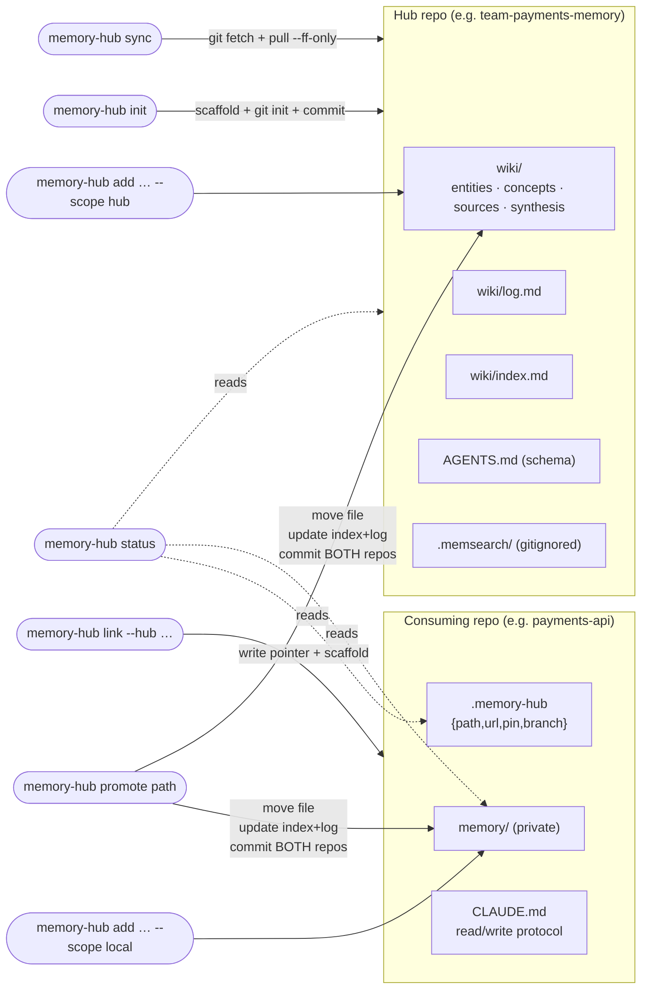

# Plan: `memory-hub` CLI — full v1

## Context
We need a memory architecture where repos belonging to the same team share knowledge while different teams' memories stay strictly isolated. The chosen architecture is **per-team hub repos** (independent git repos), with each consuming repo declaring its hub via a `.memory-hub` JSON pointer. There is no cross-domain backend.

Doing this scaffolding by hand is fiddly (wiki layouts, pointer files, hub-vs-local decisions, dual commits across repos). This plan builds the CLI tool that automates it: `memory-hub` (alias `mh`).

This plan is a refinement of `plans/search-and-find-memory-rippling-scroll.md` — same architecture and locked decisions, tightened execution path with an explicit data-flow diagram and per-command acceptance criteria so the implementer doesn't need to ask follow-up questions.

## Architecture & data flow

Directory layout (target end state):
```
~/development/
├── repo-mem/                         # "personal" hub (special-case naming)
├── team-payments-memory/             # payments team hub
├── payments-api/                     # consuming repo → links to payments hub
│   ├── .memory-hub                   # JSON pointer
│   ├── memory/                       # repo-LOCAL (private) memory
│   └── CLAUDE.md                     # two-tier read/write protocol
└── memory-hub-cli/                   # the CLI tool (this plan builds it)
```

Data flow between commands (this is what the implementer most needs to see):



Key invariants the code must enforce:
- `promote` requires clean trees in BOTH repos before moving anything; commits land in both with linked messages.
- `sync` is fetch + ff-only pull; it never auto-pushes and warns loudly on dirty trees or unpushed local hub commits.
- `init` always runs `git init` + scaffold commit so the hub is a real, fresh repo from step one.
- `.memsearch/` is always gitignored in hubs.

## Locked decisions (carried forward unchanged)
- **Architecture**: per-team hub repos; JSON `.memory-hub` pointer; `team-<name>-memory` naming with `repo-mem` as the personal-team exception.
- **Pointer schema**: `{ path, url, pin, branch }`.
- **Runtime**: Node ≥ 20, TypeScript, ESM (`type: module`), compiled to `dist/` via `tsc`.
- **Distribution**: npm; invocable as `npx memory-hub <cmd>` or installed globally.
- **CLI framework**: `commander`.
- **Git access**: shell out to `git` via `node:child_process` (no `simple-git`).
- **Filesystem**: `node:fs/promises`.
- **Templates**: inline TS string templates in `src/templates/` (no template engine).
- **Tests**: `vitest` against temp-dir fixtures using real `git init`.
- **Lint/format**: `biome`.
- **Binaries**: `memory-hub` (canonical) + `mh` (alias).
- **v1 commands**: `init`, `link`, `status`, `add`, `promote`, `sync`. `search`, `index`, `doctor`, `unlink`, `pin` deferred to v2.

## Repo layout (`~/development/memory-hub-cli/`)
```
memory-hub-cli/
├── package.json              # bin: { memory-hub, mh } → ./bin/memory-hub.js
├── tsconfig.json
├── biome.json
├── .gitignore                # dist/, node_modules/
├── bin/memory-hub.js         # shim → require('../dist/cli.js')
├── src/
│   ├── cli.ts                # commander setup, dispatch
│   ├── commands/{init,link,status,add,promote,sync}.ts
│   ├── lib/
│   │   ├── hub.ts            # resolve .memory-hub, walk to hub root, validate JSON
│   │   ├── git.ts            # status/sha/ahead-behind/fetch/pull-ff/add/commit; clean-tree assertion
│   │   ├── wiki.ts           # frontmatter, log.md append, index.md regen from dir walk
│   │   └── paths.ts          # default locations, slug validation, kind enum
│   └── templates/
│       ├── AGENTS.md.ts
│       ├── CLAUDE.md.ts
│       ├── README.md.ts
│       ├── gitignore.ts
│       └── wiki/             # index.md, log.md, kind stubs
└── tests/commands/*.test.ts
```

## Implementation order

### Phase 1 — Scaffold the CLI repo
1. `mkdir ~/development/memory-hub-cli && cd $_ && git init`.
2. Write `package.json` (Node ≥20, `type: module`, `bin: { "memory-hub": "./bin/memory-hub.js", "mh": "./bin/memory-hub.js" }`, scripts: `build`, `test`, `lint`).
3. Add deps: `commander`. Dev: `typescript`, `vitest`, `@biomejs/biome`, `@types/node`.
4. Write `tsconfig.json` (NodeNext, ES2022, `outDir: dist`, strict), `biome.json`, `.gitignore` (`dist/`, `node_modules/`).
5. `bin/memory-hub.js`: tiny ESM shim that imports `../dist/cli.js`.
6. `src/cli.ts`: commander instance registering all six commands as no-op stubs that print `"<cmd>: not implemented"`.
7. Verify `npm run build && node bin/memory-hub.js --help` lists six commands.
8. Commit: `chore: scaffold memory-hub-cli`.

### Phase 2 — Templates + `init` + `link`
1. `src/templates/`: `AGENTS.md.ts` (Karpathy wiki schema), `CLAUDE.md.ts` (two-tier read/write protocol the agent follows in a consuming repo), `README.md.ts`, `gitignore.ts` (excludes `.memsearch/`), `wiki/{index,log}.md` plus `.gitkeep`s for `entities/`, `concepts/`, `sources/`, `synthesis/`.
2. `src/lib/paths.ts`: default hub path resolver (`~/development/team-<name>-memory`, with `--team personal` ⇒ `repo-mem`); slug validator (kebab-case, no path traversal); `Kind = "entity"|"concept"|"source"|"synthesis"`.
3. `src/lib/git.ts`: `init(dir)`, `add(dir, files)`, `commit(dir, msg)`, `assertClean(dir)`, `currentSha`, `aheadBehind(dir, remote, branch)`, `fetch`, `pullFfOnly`. All shell out via `child_process.execFile("git", …, { cwd })`.
4. Implement `commands/init.ts`: parse `--team`, `--path`; resolve target dir; refuse if non-empty unless `--force`; write all template files; `git init`; first commit `chore: scaffold hub for team <name>`. Note `repo-mem` naming exception in its README.
5. Implement `commands/link.ts`: validate `--hub` is a path (resolve relative) or URL; if path, assert it looks like a hub (has `wiki/` and `AGENTS.md`); write `.memory-hub` JSON (`{ path, url?, pin?: current SHA if local path, branch: "main" }`); scaffold local `memory/` (same wiki layout, minimal); write `CLAUDE.md`. Refuse to overwrite without `--force`.
6. Tests (`tests/commands/init.test.ts`, `link.test.ts`): each spins up a temp dir, runs the command, asserts file tree, frontmatter, and a clean git log with one commit.
7. **Dogfood**: `memory-hub init --team personal --path ~/development/repo-mem`. Then in a sibling temp repo, `memory-hub link --hub ../repo-mem` and confirm the pointer + scaffold.
8. Commit: `feat: init and link commands`.

### Phase 3 — `status`, `add`, `promote`, `sync`
1. `src/lib/hub.ts`: `findHubPointer(cwd)` walks up looking for `.memory-hub`; `resolveHub(pointer)` returns absolute hub path (resolves relative-to-pointer); `validatePointer(json)` checks shape.
2. `src/lib/wiki.ts`: `frontmatter({name,type,description,created})`; `appendLog(hubOrLocal, line)` — appends `## [YYYY-MM-DD] <verb> | <title>` to `wiki/log.md` (or `memory/log.md` for local); `regenIndex(root)` — walks `entities/`, `concepts/`, `sources/`, `synthesis/`, rewrites `index.md` with grouped lists.
3. `commands/status.ts`: read pointer; print hub path/URL, hub HEAD SHA, ahead/behind vs `origin/<branch>`, entry counts (hub vs local), and any uncommitted changes in either tier.
4. `commands/add.ts`: args `<kind> <slug>`, flags `--scope hub|local` (default `local`), `--title`, `--no-edit`. Validate kind/slug. Resolve target root (local `memory/` or hub `wiki/`). Refuse if file exists. Write markdown with frontmatter; append to `log.md`; regen `index.md`. Spawn `$EDITOR` on the new file unless `--no-edit`. Do NOT auto-commit (user reviews + commits, matching git habit).
5. `commands/promote.ts`: arg `<path>` (a file under the consuming repo's `memory/`). Assert clean trees in both repos. Resolve destination as the same subpath under hub `wiki/`. `git mv` in the consuming repo (delete) and write the file into the hub. Update both `log.md`s and regen both `index.md`s. Stage + commit in BOTH repos with linked messages: hub gets `promote: <slug> from <consuming-repo-name>`, consuming repo gets `promote: <slug> -> hub`. On any failure after partial work, print recovery instructions; do not attempt automatic rollback.
6. `commands/sync.ts`: in the linked hub, `git fetch && git pull --ff-only`. Refuse if dirty. Warn if local hub has unpushed commits ahead of `origin`. Never push.
7. Tests for each command against temp-dir fixtures with real `git init` (and a bare repo serving as `origin` where needed for sync/ahead-behind).
8. **Dogfood**: in a real consuming repo: `mh link --hub ../repo-mem`, `mh add concept memory-architecture`, edit, then `mh promote memory/concepts/memory-architecture.md`, then `mh sync`. Confirm the full loop with no manual file editing.
9. Commit: `feat: status, add, promote, sync commands`.

### Phase 4 — Cross-domain isolation validation
1. `mh init --team payments` → `~/development/team-payments-memory/`.
2. From a different consuming repo: `mh link --hub ../team-payments-memory`.
3. Add a distinctive fact to each hub (one to `repo-mem`, one to `team-payments-memory`).
4. From a Claude Code session in a `repo-mem`-linked repo, ask a question only answerable from the payments hub. Confirm the agent does NOT find it. Repeat the inverse.
5. No code changes expected; if the test fails, file a bug — don't fix in this PR.

### Phase 5 — Publish
1. Choose package name (recommend unscoped `memory-hub-cli` if available; else `@geekair/memory-hub-cli`).
2. `npm publish --dry-run`, inspect tarball contents (must include `dist/`, `bin/`, `package.json`, `README.md` only).
3. `npm publish`.
4. Update READMEs to document `npx memory-hub <cmd>`.

## Verification (per phase)
- **Phase 1**: `npx memory-hub --help` lists all six commands; each prints `"not implemented"`.
- **Phase 2**: `mh init --team personal --path ~/development/repo-mem` produces the full wiki scaffold with one commit; `mh link` from a sibling repo writes `.memory-hub`, `memory/`, and `CLAUDE.md`. Vitest suites for `init` and `link` pass.
- **Phase 3**: All six commands have green vitest suites against real `git`. Manual dogfood walks `link → add → promote → sync` end-to-end without any manual file editing.
- **Phase 4**: Isolation test passes both directions.
- **Phase 5**: `npx memory-hub@latest init --team <foo>` works on a clean machine.

## Critical files this plan creates
- `~/development/memory-hub-cli/` (new repo)
  - `package.json`, `tsconfig.json`, `biome.json`, `.gitignore`, `bin/memory-hub.js`
  - `src/cli.ts`
  - `src/commands/{init,link,status,add,promote,sync}.ts`
  - `src/lib/{hub,git,wiki,paths}.ts`
  - `src/templates/{AGENTS,CLAUDE,README,gitignore}.md.ts` + `src/templates/wiki/{index,log}.md.ts`
  - `tests/commands/{init,link,status,add,promote,sync}.test.ts`
- `~/development/repo-mem/` — produced by Phase 2 dogfood.
- `~/development/team-payments-memory/` — produced by Phase 4.
- `<consuming-repo>/.memory-hub`, `<consuming-repo>/memory/`, `<consuming-repo>/CLAUDE.md` — produced by `mh link` in consuming repos.

## Out of scope (deferred)
See `plans/memory-hub-cli-todo.md`.
